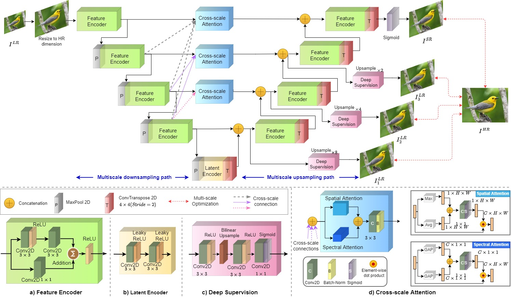
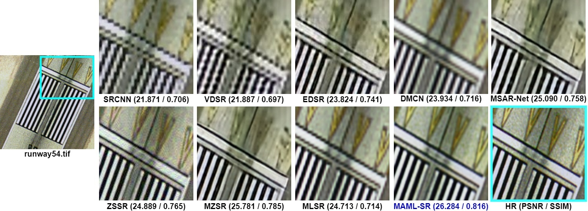
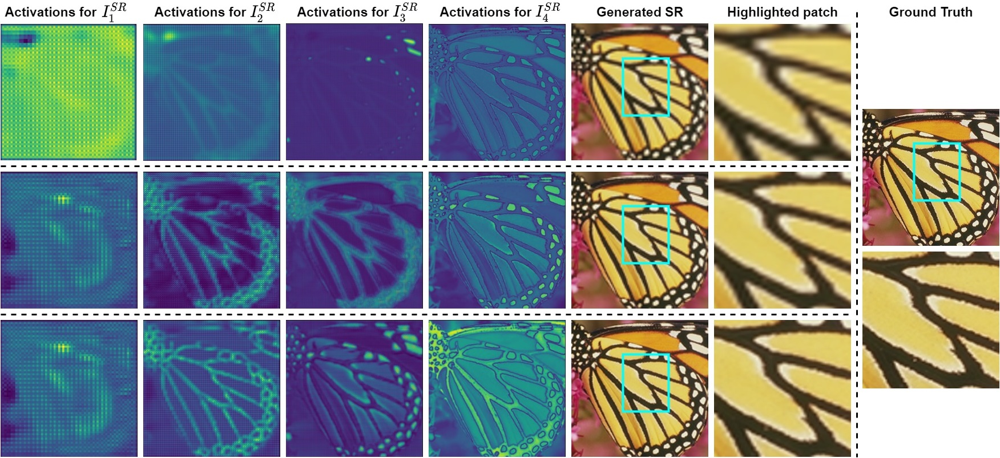

# MAML-SR: Self-Adaptive Super-Resolution Networks via Multi-scale Optimized Attention-aware Meta-Learning

The code repository for "MAML-SR: Self-Adaptive Super-Resolution Networks via Multi-scale Optimized Attention-aware Meta-Learning" [[paper]](https://) (PRL'23) in Tensorflow. 

## Abstract
 
The deep-learning-based super-resolution (SR) methods require an avalanche of training images. However, they do not adapt model parameters in test time to cope with the novel blur kernel scenarios. Even though the recent meta-learning-based SR techniques adapt trained model parameters leveraging a test image's internal patch recurrence, they need heavy pre-training on an external dataset to initialize. Also, the shallow internal information exploration and failure to amplify the salient edges impacts blurry SR image generation. Besides, model inferencing gets delayed due to a threshold-dependent adaptation phase. In this paper, we present Multi-scale Optimized Attention-aware Meta-Learning framework for SR (MAML-SR) to explore the multi-scale hierarchical self-similarity of recurring patches in a test image. Precisely, without any pre-training, we directly meta-train our model with a second-order optimization having the first-order adapted parameters from the intermediate scales, which are again directly supervised with the ground-truth HR images. At each scale, non-local self-similarity is maximized along with the amplification of salient edges using a novel cross-scale spectro-spatial attention learning unit. Also, we drastically reduce the inference delay by putting a metric-dependent constraint on the gradient updates for a test image. We demonstrate our method's superior super-resolving capability over four benchmark SR datasets.

## Comparison of the generated SR images 

## Analysis of the multiscale activation layers and generated SR images
Row-1) MAML-SR without cross-scale attention and Deep-supervision, Row-2) MAML-SR with Deep-supervision but without cross-scale attention, Row-3) MAML-SR with both Deep-supervision and cross-scale attention.

## Prerequisites

The following packages are required to run the scripts:

## Datasets

* [UC Merced](http://weegee.vision.ucmerced.edu/datasets/landuse.html)
* [DIV2K](https://data.vision.ee.ethz.ch/cvl/DIV2K/)
* [Set5, Set14](https://www.kaggle.com/datasets/ll01dm/set-5-14-super-resolution-dataset)
* [BSD100](https://huggingface.co/datasets/eugenesiow/BSD100)

## Source Code

The codes for meta-training, and meta-testing is available in src folder with the name as "MAML_SR.ipynb". 

## Citation 

If you use any content of this repo for your work, please cite the following bib entry:

## Licence

MAML-SR is released under the MIT license.

Copyright (c) 2023 Debabrata Pal. All rights reserved.

